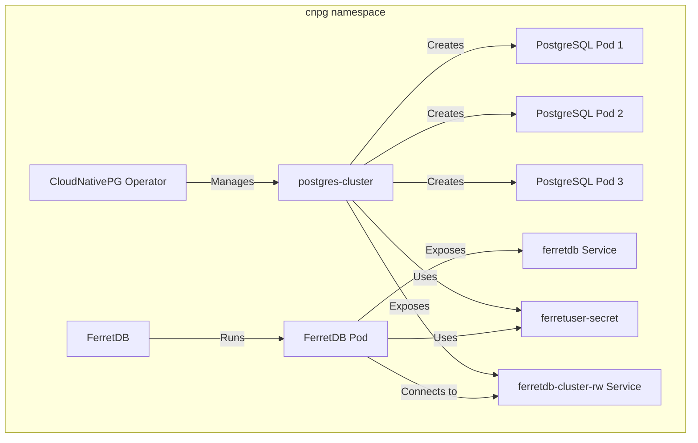

Managing, scaling, and deploying PostgreSQL database environments has become more popular and easier with Kubernetes.

<!--truncate-->

A notable option here is [CloudNativePG](https://cloudnative-pg.io/).
CloudNativePG is an open source [PostgreSQL](https://www.postgresql.org/) operator developed by [EDB](https://www.enterprisedb.com/) under an [Apache 2](https://www.apache.org/licenses/LICENSE-2.0) license for managing PostgreSQL workloads on [Kubernetes](https://kubernetes.io/) clusters on any private, public, hybrid, or multicloud environment.

For users looking to run their MongoDB workloads on a truly open source software using [FerretDB](https://www.ferretdb.com/), CloudNativePG makes it easy to deploy and manage a production-level PostgreSQL backend on a Kubernetes cluster.

In this guide, you'll learn to deploy FerretDB and PostgreSQL on Kubernetes using CloudNativePG.

## Prerequisites

- Kubernetes Cluster (You can set one up locally with Minikube)
- Docker
- `kubectl`
- Helm

To install Helm, run the following command.

```sh
curl https://raw.githubusercontent.com/helm/helm/main/scripts/get-helm-3 | bash
helm repo add stable https://charts.helm.sh/stable
helm repo update
```

## Deploy FerretDB and Postgres Cluster using CloudNativePG on Kubernetes

The main objectives of this guide are to:

1. Install CloudNativePG Operator using Helm
2. Create a Postgres cluster with three instances
3. Deploy FerretDB to connect to the Postgres cluster using the `FERRETDB_POSTGRESQL_URL` environment variable
4. Execute some CRUD commands in your FerretDB instance via `mongosh`
5. View the Postgres cluster data via `psql`
6. Clean up resources

An architecture diagram of the setup is shown below:



## Setup Postgres Cluster using CloudNative-PG

Start by installing the CloudNative-PG operator.
The following command will install the CloudNative-PG operator using Helm and deploy all resources needed into the `cnpg` namespace.

```sh
helm repo add cnpg https://cloudnative-pg.github.io/charts
helm upgrade --install cnpg \
  --namespace cnpg-system \
  --create-namespace \
  cnpg/cloudnative-pg

```

Next, create a `Secret` "ferretuser-secret" containing a username "ferretuser" and a random password within the `cnpg` namespace that complies with the specifications of the [kubernetes.io/basic-auth type](https://kubernetes.io/docs/concepts/configuration/secret/#basic-authentication-secret).

Store the following script as `create-secret.sh`.

```text
#!/bin/sh

# Generate a random password
PASSWORD="$(dd if=/dev/urandom bs=1 count=12 status=none | base64 | tr -dc 'a-zA-Z0-9' | head -c 12)"

kubectl create secret generic ferretuser-secret \
 --from-literal=username=ferretuser \
 --from-literal=password="${PASSWORD}" \
 --type=kubernetes.io/basic-auth \
 --namespace=cnpg
```

To make the script file executable, run `chmod +x create-secret.sh` from the file directory in terminal.

Then execute the script:

```sh
./create-secret.sh
```

You can confirm the secrets were created successfully by running `kubectl get secrets -n cnpg
`

### Deploy Postgres Cluster (Change the name to PGCLuster)

With the `ferretuser` secret ready, the `yaml` file below will create a Postgres cluster named "ferretdb-cluster" in the "cnpg" namespace with three instances, 1Gi storage, and initializes a database named "ferretdb" owned by "ferretuser" using credentials from the "ferretuser-secret".

```yaml
apiVersion: postgresql.cnpg.io/v1
kind: Cluster
metadata:
  name: ferretdb-cluster
  namespace: cnpg
spec:
  instances: 3
  storage:
    size: 1Gi
  bootstrap:
    initdb:
      database: ferretdb
      owner: ferretuser
      secret:
        name: ferretuser-secret
```

Apply the yaml file:

```sh
kubectl apply -f pg-cluster.yaml
```

It may take a while for all the resources to be created.
Run `kubectl get pods -n cnpg` to be sure all pods are initialized and running.

## Deploy FerretDB to connect to the Postgres cluster

Now that Postgres cluster has been deployed, let's set up and deploy FerretDB within the same namespace.
Connect FerretDB to the Postgres backend using the `FERRETDB_POSTGRESQL_URL` environment variable.

```yaml
apiVersion: apps/v1
kind: Deployment
metadata:
  name: ferretdb
  namespace: cnpg
spec:
  replicas: 1
  selector:
    matchLabels:
      app: ferretdb
  template:
    metadata:
      labels:
        app: ferretdb
    spec:
      containers:
        - name: ferretdb
          image: ghcr.io/ferretdb/ferretdb:latest
          ports:
            - containerPort: 27017
          env:
            - name: FERRETDB_POSTGRESQL_URL
              value: 'postgresql://ferretuser@ferretdb-cluster-rw.cnpg.svc.cluster.local:5432/ferretdb'

---
apiVersion: v1
kind: Service
metadata:
  name: ferretdb
  namespace: cnpg
spec:
  selector:
    app: ferretdb
  ports:
    - protocol: TCP
      port: 27017
      targetPort: 27017
  type: NodePort
```

Apply the YAML config:

```sh
kubectl apply -f ferretdeploy.yaml
```

Let's confirm that all essentials resources are created:

```sh
kubectl get cluster,pod,svc,secret -n cnpg
```

Output:

```text
NAME                                          AGE     INSTANCES   READY   STATUS                     PRIMARY
cluster.postgresql.cnpg.io/ferretdb-cluster   7d19h   3           3       Cluster in healthy state   ferretdb-cluster-1
NAME                                                READY   STATUS    RESTARTS   AGE
pod/cnpg-operator-cloudnative-pg-7bb5bf95d9-7v8cl   1/1     Running   0          7d19h
pod/ferretdb-5b4dcbcf8d-zpvll                       1/1     Running   0          9h
pod/ferretdb-cluster-1                              1/1     Running   0          7d19h
pod/ferretdb-cluster-2                              1/1     Running   0          7d19h
pod/ferretdb-cluster-3                              1/1     Running   0          7d19h
NAME                           TYPE        CLUSTER-IP       EXTERNAL-IP   PORT(S)           AGE
service/cnpg-webhook-service   ClusterIP   10.97.88.11      <none>        443/TCP           7d19h
service/ferretdb               NodePort    10.110.0.104     <none>        27017:32177/TCP   7d15h
service/ferretdb-cluster-r     ClusterIP   10.111.126.155   <none>        5432/TCP          7d19h
service/ferretdb-cluster-ro    ClusterIP   10.101.15.241    <none>        5432/TCP          7d19h
service/ferretdb-cluster-rw    ClusterIP   10.103.98.151    <none>        5432/TCP          7d19h
NAME                                         TYPE                       DATA   AGE
secret/cnpg-ca-secret                        Opaque                     2      7d19h
secret/cnpg-webhook-cert                     kubernetes.io/tls          2      7d19h
secret/ferretdb-cluster-ca                   Opaque                     2      7d19h
secret/ferretdb-cluster-replication          kubernetes.io/tls          2      7d19h
secret/ferretdb-cluster-server               kubernetes.io/tls          2      7d19h
secret/ferretuser-secret                     kubernetes.io/basic-auth   2      7d19h
secret/sh.helm.release.v1.cnpg-operator.v1   helm.sh/release.v1         1      7d19h
```

### Connect to FerretDB via `mongosh`

Temporarily run a mongosh client to be sure it's all working fine.

```sh
kubectl -n cnpg run mongosh-client --image=rtsp/mongosh --rm -it -- bash
```

That will start up a `mongosh-client` within the namespace.

```sh
mongosh 'mongodb://ferretuser:<password>@10.110.0.104:27017/ferretdb?authMechanism=PLAIN'
```

Run the following command to get the `ferretuser` password:

```sh
kubectl get secret ferretuser-secret -n cnpg -o jsonpath='{.data.password}' | base64 --decode
```

This should connect you into the FerretDB instance and the output should look like this:

```text
mongosh-client:/# mongosh 'mongodb://ferretuser:<password>@10.110.0.104:27017/ferretdb?authMechanism=PLAIN'
Current Mongosh Log ID: 667388855d643f01696bade7
Connecting to:    mongodb://<credentials>@10.110.0.104:27017/ferretdb?authMechanism=PLAIN&directConnection=true&appName=mongosh+2.2.9
Using MongoDB:    7.0.42
Using Mongosh:    2.2.9
For mongosh info see: https://docs.mongodb.com/mongodb-shell/
------
   The server generated these startup warnings when booting
   2024-06-20T01:40:21.558Z: Powered by FerretDB v1.21.0 and PostgreSQL 16.2.
   2024-06-20T01:40:21.558Z: Please star us on GitHub: https://github.com/FerretDB/FerretDB.
   2024-06-20T01:40:21.558Z: The telemetry state is undecided.
   2024-06-20T01:40:21.558Z: Read more about FerretDB telemetry and how to opt out at https://beacon.ferretdb.com.
------
ferretdb>
```

### Test CRUD commands in `mongosh`

```text
ferretdb> db.testCollection.insertMany([
...   { name: "Alice", age: 25, city: "Wonderland" },
...   { name: "Bob", age: 30, city: "Builderland" },
...   { name: "Charlie", age: 35, city: "Chocolate Factory" }
... ]);
{
  acknowledged: true,
  insertedIds: {
    '0': ObjectId('66741445f0f21e98f96bade8'),
    '1': ObjectId('66741445f0f21e98f96bade9'),
    '2': ObjectId('66741445f0f21e98f96badea')
  }
}
ferretdb> db.testCollection.updateOne({ name: "Alice" }, { $set: { age: 26 } });
{
  acknowledged: true,
  insertedId: null,
  matchedCount: 1,
  modifiedCount: 1,
  upsertedCount: 0
}
ferretdb> db.testCollection.deleteMany({ age: { $lt: 35 } });
{ acknowledged: true, deletedCount: 2 }
ferretdb> db.testCollection.countDocuments();
1

```

### Connect to Postgres cluster via `psql`

Want to see what the data looks like in Postgres?
Let's create a temporary `postgres-client` pod to connect to the `ferretdb-cluster-1` pod.

```sh
kubectl exec -it ferretdb-cluster-1 -n cnpg -- /bin/bash
```

Within the Pod, connect to the PostgreSQL database:

```sh
psql postgresql://ferretuser:<password>@ferretdb-cluster-rw.cnpg.svc.cluster.local:5432/ferretdb
```

```text
postgres@
psql postgresql://ferretuser:<password>@ferretdb-cluster-rw.cnpg.svc.cluster.local:5432/ferretdb
psql (16.2 (Debian 16.2-1.pgdg110+2))
SSL connection (protocol: TLSv1.3, cipher: TLS_AES_256_GCM_SHA384, compression: off)
Type "help" for help.

ferretdb=> SET SEARCH_PATH TO FERRETDB;
SET
ferretdb=> \dt
                      List of relations
  Schema  |            Name             | Type  |   Owner
----------+-----------------------------+-------+------------
 ferretdb | _ferretdb_database_metadata | table | ferretuser
 ferretdb | testcollection_c141f891     | table | ferretuser
(2 rows)
ferretdb=> select * from testcollection_c141f891;
                                                                                                                        _jsonb
------------------------------------------------------------------------------------------------------------------------------------------------------------------------------------------------------------------------------------------------------
 {"$s": {"p": {"_id": {"t": "objectId"}, "age": {"t": "int"}, "city": {"t": "string"}, "name": {"t": "string"}}, "$k": ["_id", "name", "age", "city"]}, "_id": "66741445f0f21e98f96badea", "age": 35, "city": "Chocolate Factory", "name": "Charlie"}
(1 row)
```

## Clean up resources

```sh
kubectl delete namespace cnpg
minikube stop
minikube delete
```

## Additional resources

You can also read up on other open source PostgreSQL deployments here below:

- [Learn to Deploy FerretDB and Percona PostgreSQL Operator on Kubernetes on Taikun CloudWorks](https://blog.ferretdb.io/deploy-ferretdb-kubernetes-taikun-cloudworks/)
- [How to Deploy and Run FerretDB and Crunchy Postgres Operator on Leafcloud](https://blog.ferretdb.io/deploy-run-ferretdb-leafcloud/)
- [How to Run FerretDB on Top of StackGres](https://blog.ferretdb.io/run-ferretdb-on-stackgres/)

To learn more about FerretDB, see our documentation.
