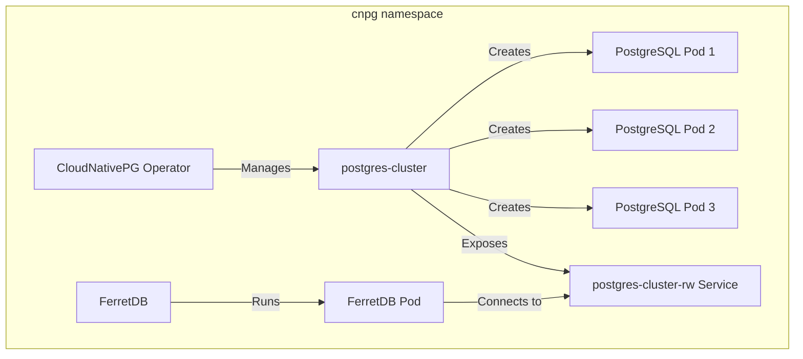

Managing, scaling, and deploying PostgreSQL database environments on Kubernetes has become increasingly popular and easier in recent times.
A notable tool facilitating this process is CloudNativePG.

<!--truncate-->

[CloudNativePG](https://cloudnative-pg.io/) is an open source [PostgreSQL](https://www.postgresql.org/) operator developed by [EDB](https://www.enterprisedb.com/) under an [Apache 2](https://www.apache.org/licenses/LICENSE-2.0) license.
It's designed for managing PostgreSQL workloads on [Kubernetes](https://kubernetes.io/) clusters on any private, public, hybrid, or multicloud environment.

For users looking to run their MongoDB workloads on a truly open source software using [FerretDB](https://www.ferretdb.com/), CloudNativePG simplifies the deployment and management of production-level PostgreSQL backend on a Kubernetes cluster.

In this guide, you'll learn how to deploy FerretDB and PostgreSQL on Kubernetes using CloudNativePG.

## Prerequisites

Ensure you have the following tools installed:

- Kubernetes Cluster (You can set one up locally with [minikube](https://minikube.sigs.k8s.io/))
- [`kubectl`](https://kubernetes.io/docs/reference/kubectl/)
- [Helm](https://helm.sh/): If you don't have it installed, run the following command to install it:

  ```sh
  curl https://raw.githubusercontent.com/helm/helm/main/scripts/get-helm-3 | bash
  helm repo add stable https://charts.helm.sh/stable
  helm repo update
  ```

## Deploy FerretDB and Postgres cluster using CloudNativePG on Kubernetes

The main objectives of this guide are to:

1. Install CloudNativePG operator using Helm
2. Create a Postgres cluster with three instances
3. Deploy FerretDB to connect to the Postgres cluster using the `FERRETDB_POSTGRESQL_URL` environment variable
4. Execute some CRUD commands in your FerretDB instance via `mongosh`
5. View the Postgres cluster data via `psql`
6. Clean up resources

An architecture diagram of the setup is shown below:



## Setup Postgres cluster using CloudNative-PG

Start by installing the CloudNative-PG operator.
The following command will install the CloudNative-PG operator using Helm and deploy all resources needed to the `cnpg` namespace.

```sh
helm repo add cnpg https://cloudnative-pg.github.io/charts
helm upgrade --install cnpg \
  --namespace cnpg \
  --create-namespace \
  cnpg/cloudnative-pg
```

Next, create a `Secret` "ferretuser-secret" containing a username "ferretuser" and a random password within the `cnpg` namespace that complies with the specifications of the [kubernetes.io/basic-auth type](https://kubernetes.io/docs/concepts/configuration/secret/#basic-authentication-secret).

Store the following script as `create-secret.sh`.

```text
#!/bin/sh

# Generate a random password
PASSWORD="$(dd if=/dev/urandom bs=1 count=12 status=none | base64 | tr -dc 'a-zA-Z0-9' | head -c 12)"

kubectl create secret generic ferretuser-secret \
 --from-literal=username=ferretuser \
 --from-literal=password="${PASSWORD}" \
 --type=kubernetes.io/basic-auth \
 --namespace=cnpg
```

To make the script file executable, run `chmod +x create-secret.sh` from the file directory in terminal.

Then execute the script to create the `Secret` in the `cnpg` namespace:

```sh
./create-secret.sh
```

Confirm the `Secret` was created successfully by running `kubectl get secrets -n cnpg`.

### Deploy Postgres cluster

The `yaml` file below will create a Postgres cluster named "postgres-cluster" in the "cnpg" namespace with three instances, 1Gi storage, and initializes a database named "ferretdb" owned by "ferretuser" using credentials from the "ferretuser-secret".

```yaml
apiVersion: postgresql.cnpg.io/v1
kind: Cluster
metadata:
  name: postgres-cluster
  namespace: cnpg
spec:
  instances: 3
  storage:
    size: 1Gi
  bootstrap:
    initdb:
      database: ferretdb
      owner: ferretuser
      secret:
        name: ferretuser-secret
```

Apply the `yaml` file:

```sh
kubectl apply -f pg-cluster.yaml
```

It may take a while for all the resources to be created.
Run `kubectl get pods -n cnpg` to be sure all pods are initialized and running.

The output should look like this:

```text
NAME                                   READY   STATUS    RESTARTS   AGE
cnpg-cloudnative-pg-6685f6c7b8-5w8pp   1/1     Running   0          11m
postgres-cluster-1                     1/1     Running   0          116s
postgres-cluster-2                     1/1     Running   0          97s
postgres-cluster-3                     1/1     Running   0          79s
```

## Deploy FerretDB to connect to the Postgres cluster

Now that Postgres cluster has been deployed, let's set up and deploy FerretDB within the same namespace.
Create another `yaml` file named "ferretdeployment.yaml" for the FerretDB deployment.

FerretDB will connect to the Postgres cluster using the `FERRETDB_POSTGRESQL_URL` environment variable.
The `FERRETDB_POSTGRESQL_URL` environment variable is set without a password to avoid exposing it in the `yaml` file while still ensuring authenticated connections.

```yaml
apiVersion: apps/v1
kind: Deployment
metadata:
  name: ferretdb
  namespace: cnpg
spec:
  replicas: 1
  selector:
    matchLabels:
      app: ferretdb
  template:
    metadata:
      labels:
        app: ferretdb
    spec:
      containers:
        - name: ferretdb
          image: ghcr.io/ferretdb/ferretdb:latest
          ports:
            - containerPort: 27017
          env:
            - name: FERRETDB_POSTGRESQL_URL
              value: 'postgresql://ferretuser@postgres-cluster-rw.cnpg.svc.cluster.local:5432/ferretdb'

---
apiVersion: v1
kind: Service
metadata:
  name: ferretdb-service
  namespace: cnpg
spec:
  selector:
    app: ferretdb
  ports:
    - protocol: TCP
      port: 27017
      targetPort: 27017
  type: NodePort
```

Apply the `yaml` config:

```sh
kubectl apply -f ferretdeployment.yaml
```

Confirm that all essentials resources have been created:

```sh
kubectl get cluster,pod,svc,secret -n cnpg
```

Output:

```text
NAME                                          AGE   INSTANCES   READY   STATUS                     PRIMARY
cluster.postgresql.cnpg.io/postgres-cluster   17m   3           3       Cluster in healthy state   postgres-cluster-1

NAME                                       READY   STATUS    RESTARTS   AGE
pod/cnpg-cloudnative-pg-6685f6c7b8-5w8pp   1/1     Running   0          20m
pod/ferretdb-f6864c9c7-w8wwx               1/1     Running   0          5s
pod/postgres-cluster-1                     1/1     Running   0          10m
pod/postgres-cluster-2                     1/1     Running   0          10m
pod/postgres-cluster-3                     1/1     Running   0          9m53s

NAME                           TYPE        CLUSTER-IP       EXTERNAL-IP   PORT(S)           AGE
service/cnpg-webhook-service   ClusterIP   10.104.218.212   <none>        443/TCP           20m
service/ferretdb-service       NodePort    10.107.244.213   <none>        27017:30987/TCP   3m55s
service/postgres-cluster-r     ClusterIP   10.107.141.185   <none>        5432/TCP          17m
service/postgres-cluster-ro    ClusterIP   10.110.7.253     <none>        5432/TCP          17m
service/postgres-cluster-rw    ClusterIP   10.98.97.107     <none>        5432/TCP          17m

NAME                                  TYPE                       DATA   AGE
secret/cnpg-ca-secret                 Opaque                     2      17m
secret/cnpg-webhook-cert              kubernetes.io/tls          2      17m
secret/ferretuser-secret              kubernetes.io/basic-auth   2      19m
secret/postgres-cluster-ca            Opaque                     2      17m
secret/postgres-cluster-replication   kubernetes.io/tls          2      17m
secret/postgres-cluster-server        kubernetes.io/tls          2      17m
secret/sh.helm.release.v1.cnpg.v1     helm.sh/release.v1         1      20m
```

### Connect to FerretDB via `mongosh`

Create a temporary `mongosh` client to connect to the FerretDB instance.

```sh
kubectl -n cnpg run mongosh-client --image=rtsp/mongosh --rm -it -- bash
```

That will start up a `mongosh-client` within the namespace.

```sh
mongosh 'mongodb://ferretuser:<password>@ferretdb-service:27017/ferretdb?authMechanism=PLAIN'
```

Run the following command to get the `ferretuser` password:

```sh
kubectl get secret ferretuser-secret -n cnpg -o jsonpath='{.data.password}' | base64 --decode
```

This should connect you to the FerretDB instance and the output should look like this:

```text
mongosh-client:/# mongosh 'mongodb://ferretuser:<password>@ferretdb-service:27017/ferretdb?authMechanism=PLAIN'
Current Mongosh Log ID: 667388855d643f01696bade7
Connecting to:    mongodb://<credentials>@ferretdb-service:27017/ferretdb?authMechanism=PLAIN&directConnection=true&appName=mongosh+2.2.9
Using MongoDB:    7.0.42
Using Mongosh:    2.2.9
For mongosh info see: https://docs.mongodb.com/mongodb-shell/
------
   The server generated these startup warnings when booting
   2024-06-20T01:40:21.558Z: Powered by FerretDB v1.21.0 and PostgreSQL 16.2.
   2024-06-20T01:40:21.558Z: Please star us on GitHub: https://github.com/FerretDB/FerretDB.
   2024-06-20T01:40:21.558Z: The telemetry state is undecided.
   2024-06-20T01:40:21.558Z: Read more about FerretDB telemetry and how to opt out at https://beacon.ferretdb.com.
------
ferretdb>
```

### Test CRUD commands in `mongosh`

Now that you are connected to the FerretDB instance, let's run some CRUD commands.

Start by creating a collection and inserting some documents:

```js
db.testCollection.insertMany([
  { name: 'Alice', age: 25, city: 'Wonderland' },
  { name: 'Bob', age: 30, city: 'Builderland' },
  { name: 'Charlie', age: 35, city: 'Chocolate Factory' }
])
```

Output:

```json5
{
  acknowledged: true,
  insertedIds: {
    '0': ObjectId('66741445f0f21e98f96bade8'),
    '1': ObjectId('66741445f0f21e98f96bade9'),
    '2': ObjectId('66741445f0f21e98f96badea')
  }
}
```

Next let's update a document:

```js
db.testCollection.updateOne({ name: 'Alice' }, { $set: { age: 26 } })
```

Output:

```json5
{
  acknowledged: true,
  insertedId: null,
  matchedCount: 1,
  modifiedCount: 1,
  upsertedCount: 0
}
```

Delete documents where age is less than 35:

```js
db.testCollection.deleteMany({ age: { $lt: 35 } })
```

Output:

```json5
{ acknowledged: true, deletedCount: 2 }
```

Count the number of documents in the collection:

```js
db.testCollection.countDocuments()
```

Output:

```json5
1
```

### Connect to Postgres cluster via `psql`

Want to see what the data looks like in Postgres?

From another terminal window, let's create a temporary `postgres-client` pod to connect to the `postgres-cluster-1` pod.

```sh
kubectl exec -it postgres-cluster-1 -n cnpg -- /bin/bash
```

Connect to the PostgreSQL database:

```sh
psql postgresql://ferretuser:<password>@postgres-cluster-rw.cnpg.svc.cluster.local:5432/ferretdb
```

```text
postgres@
psql postgresql://ferretuser:<password>@postgres-cluster-rw.cnpg.svc.cluster.local:5432/ferretdb
psql (16.2 (Debian 16.2-1.pgdg110+2))
SSL connection (protocol: TLSv1.3, cipher: TLS_AES_256_GCM_SHA384, compression: off)
Type "help" for help.

ferretdb=> SET SEARCH_PATH TO FERRETDB;
SET
ferretdb=> \dt
                      List of relations
  Schema  |            Name             | Type  |   Owner
----------+-----------------------------+-------+------------
 ferretdb | _ferretdb_database_metadata | table | ferretuser
 ferretdb | testcollection_c141f891     | table | ferretuser
(2 rows)
ferretdb=> select * from testcollection_c141f891;
                                                                                                                        _jsonb
------------------------------------------------------------------------------------------------------------------------------------------------------------------------------------------------------------------------------------------------------
 {"$s": {"p": {"_id": {"t": "objectId"}, "age": {"t": "int"}, "city": {"t": "string"}, "name": {"t": "string"}}, "$k": ["_id", "name", "age", "city"]}, "_id": "66741445f0f21e98f96badea", "age": 35, "city": "Chocolate Factory", "name": "Charlie"}
(1 row)
```

## Clean up resources

To clean up the resources created in the `cnpg` namespace, run the following command:

```sh
kubectl delete namespace cnpg
```

When you are done with the FerretDB and PostgreSQL cluster resources, you can delete the entire cluster.
This will depend on how your Kubernetes cluster is set up.
For example, if you used minikube, you can delete the cluster with the following commands:

```sh
minikube stop
minikube delete
```

Note that this will delete all resources in the cluster.

## Additional resources

You can also read up on how to deploy FerretDB with other open source PostgreSQL operators here below:

- [Learn to Deploy FerretDB and Percona PostgreSQL Operator on Kubernetes on Taikun CloudWorks](https://blog.ferretdb.io/deploy-ferretdb-kubernetes-taikun-cloudworks/)
- [How to Deploy and Run FerretDB and Crunchy Postgres Operator on Leafcloud](https://blog.ferretdb.io/deploy-run-ferretdb-leafcloud/)
- [How to Run FerretDB on Top of StackGres](https://blog.ferretdb.io/run-ferretdb-on-stackgres/)

To learn more about FerretDB, [see our documentation](https://docs.ferretdb.io/understanding-ferretdb/).
