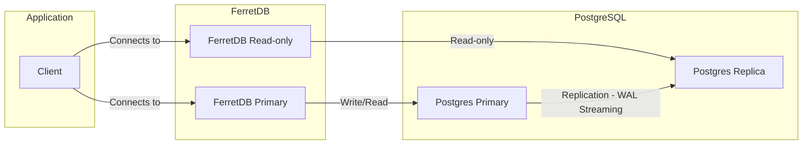

Speed and reliability are critical for all databases – every millisecond matters.
When serving data to your users, every second of downtime can lead to lost revenue and unhappy customers.

<!--truncate-->

For applications that demand high availability and disaster recovery, replication is an essential feature.
Now, with the release of FerretDB v2 (which uses PostgreSQL with DocumentDB extension as the storage engine) and its replication capabilities, developers and businesses can create fault-tolerant and highly available database environments.

In this blog post, we'll discuss replication, its importance and benefits, and how FerretDB can help you create a reliable and fault-tolerant environment.

## What is replication?

Replication is a database technique for storing and distributing multiple copies of data across different servers.
It works by maintaining one primary database where all writes happen and one or more read-only replicas that sync with the primary.
Setting up your database this way ensures a reduction in the load on the primary instance, boosts query performance, and enhances fault tolerance.

In FerretDB, replication is designed to enable users build fault-tolerant applications that can handle large volumes of queries efficiently and with minimal disruption in case of failures.
Users can distribute traffic across different database replicas – and potentially speed up read operations – while preventing downtime or data loss by promoting a replica when the primary server is down.

Before we go into how this looks in practice, let's take a look at some of the benefits of replication and why it's critical for many businesses.

## Why replication matters for FerretDB users

### Performance at scale

It's a common story: as applications grow, databases quickly become bottlenecks – if the load is not managed well.
Read-heavy workloads, such as analytics dashboards, recommendation engines, and content-serving applications, can overwhelm a single database instance.
By having copies of your data on multiple databases, you can easily scale your FerretDB instance by offloading queries to multiple replicas.

Applications can route queries to the nearest available replica; that way, you can reduce latency and improve response times.
So, regardless of the kind of application you have, replication can help enable fast and consistent access to your data if you want.

### Improved fault tolerance

No database is immune to failures, but a resilient architecture can surely prevent downtime.
By setting up replication in FerretDB, applications can continue serving users from a replica database even if the primary PostgreSQL instance experiences issues.
When one replica goes offline, traffic can be redirected to another – without impacting availability.
Similarly, if the primary database fails, a replica can be promoted to primary to ensure continuous operations.

This is especially valuable for mission-critical applications where uptime is essential.
Industries like fintech, healthcare, and logistics rely on constant data availability; having multiple synchronized replicas lead to uninterrupted operations even during unexpected disruptions.

## How replication works in FerretDB

Unlike MongoDB, replication works a bit differently in FerretDB.
Replication in FerretDB relies entirely on PostgreSQL's native replication mechanisms.
However, only the Write-Ahead Logging (WAL) streaming method is currently supported.

Here's an example of a replication setup in FerretDB:

The replication process involves setting up a primary PostgreSQL database that handles all write operations.
Read replicas – also powered by PostgreSQL – continuously sync with the primary database, receiving updates through streaming replication.
This ensures that all replicas have an up-to-date copy of the data without affecting write performance on the primary.

The application client connects to FerretDB, which has both a primary instance (handling writes and reads to the Primary PostgreSQL instance) and read-only instance (handling only reads to the replica).

If you have multiple replicas in PostgreSQL, data reads may be distributed between replicas to enable lower latency.

## Caveats and considerations for replication in FerretDB

While replication brings significant advantages, there are some caveats to be aware of in a FerretDB setup.

If a PostgreSQL primary failure occurs, promoting a replica to primary requires additional orchestration.
FerretDB does not include built-in mechanisms for automatic failover, meaning third-party tools or custom scripts are necessary for better transitions.
So when the primary PostgreSQL instance fails and a replica is promoted, the proxy can automatically redirect traffic to the new primary dynamically – without requiring manual updates in FerretDB.

Similarly, FerretDB does not automatically balance queries across different instances.
To effectively distribute requests among multiple FerretDB instances, an external load balancer like HAProxy is necessary.

As with any asynchronous replication strategy, replicas may experience some delay in syncing data from the primary.
Applications relying on real-time data consistency must account for potential discrepancies between the primary and read replicas.

## Getting started with replication in FerretDB

Replication is one of the new features that come with FerretDB 2.0 – it also includes vector search, extensive aggregation operations, and higher feature compatibility with MongoDB.
Learn more about the release [here](https://blog.ferretdb.io/ferretdb-releases-v2-faster-more-compatible-mongodb-alternative/).

Organizations can now go ahead to implement replication strategies based on their workload requirements, performance needs, and geographic distribution goals.
They can improve query response times, balance traffic, and scale globally with replication.

As FerretDB evolves, expect even more enhancements to support load-intensive applications that want to migrate from MongoDB.
FerretDB Cloud is also in the works, offering a fully managed database service – join the waitlist for early access [here](https://cloud.ferretdb.com/signup).

For a more extensive implementation of replication in FerretDB, [check out our guide on setting up replication for FerretDB](https://docs.ferretdb.io/guides/replication/).
