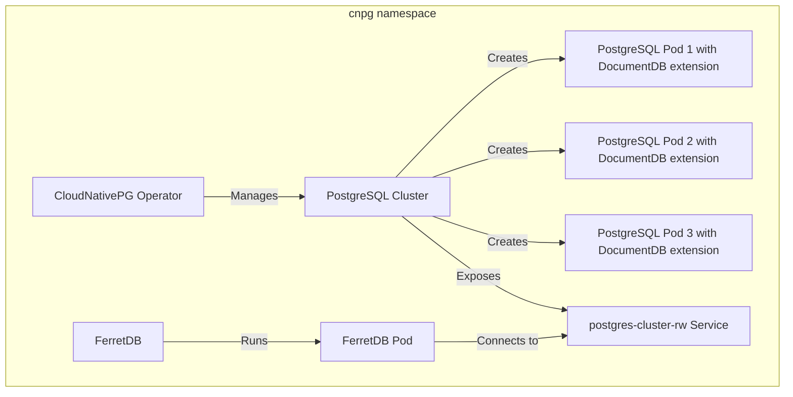

Running FerretDB on Kubernetes typically requires managing a PostgreSQL backend.
With [CloudNativePG](https://cloudnative-pg.io/), a Kubernetes-native operator for PostgreSQL, you can automate provisioning, scaling, and failover while ensuring a production-ready infrastructure.

<!--truncate-->

We previously covered [how to run FerretDB on Kubernetes using CloudNativePG (CNPG) as the PostgreSQL operator](https://blog.ferretdb.io/run-ferretdb-cloudnativepg-kubernetes/).
While that guide remains relevant for FerretDB v1.x, we've since [released FerretDB v2.0](https://blog.ferretdb.io/ferretdb-v2-ga-open-source-mongodb-alternative-ready-for-production/), which brings significant changes: improved performance, better MongoDB compatibility, and new features.
One key change – FerretDB v2.x now requires a PostgreSQL backend with the DocumentDB extension.

This blog post will walk you through the steps to deploy FerretDB and PostgreSQL with DocumentDB extension using CloudNativePG on Kubernetes.

## Prerequisites

- A Kubernetes cluster (e.g., [kind](https://kind.sigs.k8s.io/), [minikube](https://minikube.sigs.k8s.io/docs/), or a managed service like GKE, EKS, or AKS).
- `kubectl` installed and configured to access your cluster.
- `helm` installed for managing Kubernetes applications.
- `mongosh` installed for connecting to FerretDB.

A basic architecture of the setup looks like this:



## Install CNPG with Helm

Install the CNPG operator using Helm.
This operator will manage the PostgreSQL cluster.

```sh
helm repo add cnpg https://cloudnative-pg.github.io/charts
helm upgrade --install cnpg \
  --namespace cnpg \
  --create-namespace \
  cnpg/cloudnative-pg
```

## Create the PostgreSQL cluster

We'll now define a PostgreSQL cluster using CNPG.
This cluster will run 3 Postgres instances using the PostgreSQL with DocumentDB extension image.

Save this as `pg-cluster.yaml`:

```yaml
apiVersion: postgresql.cnpg.io/v1
kind: Cluster
metadata:
  name: postgres-cluster
  namespace: cnpg
spec:
  instances: 3
  imageName: 'ghcr.io/ferretdb/postgres-documentdb:17-0.106.0-ferretdb-2.5.0'
  postgresUID: 999
  postgresGID: 999
  enableSuperuserAccess: true

  storage:
    size: 1Gi

  postgresql:
    shared_preload_libraries:
      - pg_cron
      - pg_documentdb_core
      - pg_documentdb
    parameters:
      cron.database_name: 'postgres'
    pg_hba:
      - host postgres postgres 127.0.0.1/32 trust
      - host postgres postgres ::1/128 trust

  bootstrap:
    initdb:
      postInitSQL:
        - 'CREATE EXTENSION IF NOT EXISTS documentdb CASCADE;'
```

We explicitly enable `enableSuperuserAccess` so that we can connect with the default `postgres` user.

CloudNativePG runs PostgreSQL with UID 26 by default, but the DocumentDB image requires UID and GID 999.
Be sure to set both explicitly to avoid permission errors.

Since CloudNativePG doesn't execute entrypoint scripts from the image, we need to manually create the extension during initialization.
We need to explicitly list `pg_cron`, `pg_documentdb_core`, and `documentdb` in `shared_preload_libraries` and use `postInitSQL` to create the extension.
The `cron.database_name` parameter is set to `postgres` to ensure that the cron jobs run in the correct database.

Apply it:

```sh
kubectl apply -f pg-cluster.yaml -n cnpg
```

CNPG will handle cluster creation, persistent storage, and generate a password for the `postgres` superuser in Secret.

You can check the status of the cluster with:

```sh
kubectl get cluster -n cnpg
```

You should see the cluster in `Running` state.

```text
NAME               AGE    INSTANCES   READY   STATUS                     PRIMARY
postgres-cluster   176m   3           3       Cluster in healthy state   postgres-cluster-1
```

To get the generated password for the `postgres` user:

```sh
kubectl get secret -n cnpg postgres-cluster-superuser -o jsonpath='{.data.password}' | base64 -d && echo
```

## Deploy FerretDB

With the PostgreSQL backend ready, let's deploy FerretDB.
FerretDB expects you to specify the connection string to the PostgreSQL backend via the `FERRETDB_POSTGRESQL_URL` environment variable.

Save this as `ferretdb.yaml`:

```yaml
apiVersion: apps/v1
kind: Deployment
metadata:
  name: ferretdb
  namespace: cnpg
spec:
  replicas: 1
  selector:
    matchLabels:
      app: ferretdb
  template:
    metadata:
      labels:
        app: ferretdb
    spec:
      containers:
        - name: ferretdb
          image: ghcr.io/ferretdb/ferretdb:2.5.0
          ports:
            - containerPort: 27017
          env:
            - name: FERRETDB_POSTGRESQL_URL
              value: 'postgresql://postgres:<password>@postgres-cluster-rw.cnpg.svc.cluster.local:5432/postgres'

---
apiVersion: v1
kind: Service
metadata:
  name: ferretdb-service
  namespace: cnpg
spec:
  selector:
    app: ferretdb
  ports:
    - protocol: TCP
      port: 27017
      targetPort: 27017
  type: NodePort
```

The connection string uses the `postgres` superuser created by CNPG, the service endpoint exposed by the PostgreSQL cluster (`postgres-cluster-rw`), and the default `postgres` database.
Be sure to replace `<password>` with the actual password you retrieved earlier.
For production environments, instead of hardcoding the password, consider using secrets to manage sensitive information.

We are also creating a service named `ferretdb-service` that exposes the FerretDB deployment on port `27017`.

Then apply it:

```sh
kubectl apply -f ferretdb.yaml -n cnpg
```

Check the status of the FerretDB pod to ensure that it is running:

```sh
kubectl get pods -n cnpg
```

## Connect to FerretDB

Expose FerretDB locally by port-forwarding its service:

```sh
kubectl port-forward svc/ferretdb-service -n cnpg 27017:27017
```

Then in another terminal, connect to FerretDB using `mongosh`:

```sh
mongosh "mongodb://postgres:<password>@localhost:27017/"
```

You're now connected to FerretDB via `mongosh`.

### Test CRUD operations

Try a quick test to ensure everything is working correctly.

```js
db.test.insertOne({ hello: 'world' })
db.test.find()
```

This verifies that FerretDB is up and the entire setup is functioning as expected.

## Conclusion

You now have FerretDB v2 running on Kubernetes, backed by a production-grade PostgreSQL cluster managed by CloudNativePG.
This setup offers MongoDB compatibility with the reliability and ecosystem of PostgreSQL.
For production deployments, consider enabling backups, monitoring, authentication, and scaling strategies.

Have any questions?
Reach out to us on [our community channels](https://docs.ferretdb.io/#community).
