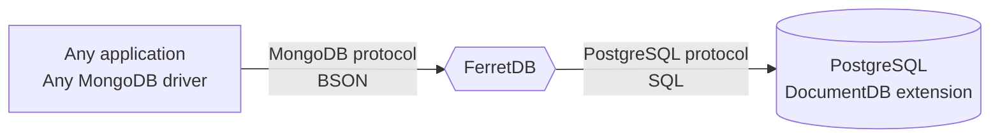

# Introduction

FerretDB is an open-source alternative to MongoDB.
It is a proxy that converts MongoDB 5.0+ wire protocol queries to SQL
and uses PostgreSQL with [DocumentDB extension](https://github.com/microsoft/documentdb) as a database engine.

## Why do we need FerretDB?

When MongoDB was initially created, it represented a welcome change from traditional relational databases with its ease of use and well-documented drivers that made it a popular choice among developers.
However, as MongoDB moved away from its open-source roots to [SSPL license](https://www.ferretdb.com/sspl), it introduced licensing complexities that made it unsuitable for many open-source and early-stage commercial projects.

FerretDB was created as an alternative to MongoDB – one that is easy to use (with familiar language and commands) and free from licensing restrictions.
This makes it suitable for developers and organizations that need an open-source document database with MongoDB compatibility.

## Scope and current state

FerretDB is compatible with MongoDB drivers and can be used as a direct replacement for MongoDB 5.0+.
We are constantly adding features to increase compatibility based on user feedback.
As with any database, before moving to production, please verify if it is suitable for your application.

See our [public roadmap](https://github.com/orgs/FerretDB/projects/2/views/1),
a list of [known differences with MongoDB](migration/diff.md),
and [contributing guidelines](https://github.com/FerretDB/FerretDB/blob/main/CONTRIBUTING.md).

:::tip
New to FerretDB?

See our:

- [Evaluation setup guide for quick testing and experiments](installation/evaluation.md)
- [FerretDB installation](installation/ferretdb/)
- [DocumentDB installation](installation/documentdb/)
- [Usage guides](usage/)

:::

## Community

- Website and blog: https://www.ferretdb.com/.
- Twitter: [@ferret_db](https://twitter.com/ferret_db).
- Mastodon: [@ferretdb@techhub.social](https://techhub.social/@ferretdb).
- [Slack chat](https://join.slack.com/t/ferretdb/shared_invite/zt-zqe9hj8g-ZcMG3~5Cs5u9uuOPnZB8~A) for quick questions.
- [GitHub Discussions](https://github.com/FerretDB/FerretDB/discussions) for longer topics.
- [GitHub Issues](https://github.com/FerretDB/FerretDB/issues) for bugs and missing features.
- [Open Office Hours meeting](https://calendar.google.com/calendar/event?action=TEMPLATE&tmeid=NGhrZTA5dXZ0MzQzN2gyaGVtZmx2aWxmN2pfMjAyNDA0MDhUMTcwMDAwWiBjX24zN3RxdW9yZWlsOWIwMm0wNzQwMDA3MjQ0QGc&tmsrc=c_n37tquoreil9b02m0740007244%40group.calendar.google.com&scp=ALL)
  every Monday at 17:00 UTC at [Google Meet](https://meet.google.com/mcb-arhw-qbq).

If you want to contact FerretDB Inc., please use [this form](https://www.ferretdb.com/contact/).
